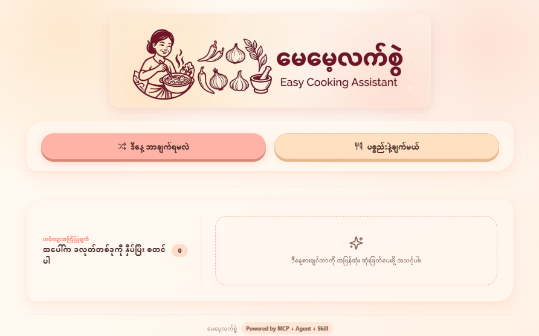

# မေမေ့လက်စွဲ — MayMay's Latt Swal

> Myanmar-first cooking assistant — suggest meals, search by ingredients, cook with confidence.

## What it does

Open the app, tap **"ဒီနေ့ ဘာချက်ရမလဲ"** (What should I cook today?) and get 3 random Myanmar recipe suggestions. Or tap **"ပစ္စည်းနဲ့ချက်မယ်"** (Cook with what I have), type your available ingredients, and the app finds the best matching recipes from a local dataset of 30+ traditional Myanmar dishes.

## Features

- 🎲 **Random meal suggestion** — tap once, get 3 recipe ideas instantly
- 🔍 **Ingredient-based search** — type what you have, find what you can cook
- ⏱ **Cooking time filter** — Quick (<20 min), Medium (20–40 min), Slow (40+ min)
- 📋 **Step-by-step checklist** — tick off steps as you cook
- 🍛 **30+ Myanmar recipes** — from ကြက်ဥခရမ်းချဉ်သီးချက် to အုန်းနို့ခေါက်ဆွဲ
- 🇲🇲 **Myanmar-first interface** — all text in Burmese, no English mixed in
- 📱 **Mobile-friendly** — works on phones, tablets, and desktop
- 🧠 **AI agent architecture** — deterministic MCP + Skill + Agent workflow

## Screenshots

| Home | Search Results | Recipe Detail |
|------|---------------|---------------|
|  |  |  |

## Architecture

```
┌──────────────┐     ┌──────────────┐     ┌──────────────┐
│   React UI   │────▶│  Meal Planner │────▶│   Recipe     │
│   (App.jsx)  │     │  Agent        │     │   Assistant  │
└──────────────┘     └──────┬───────┘     │   Skill      │
                            │              └──────┬───────┘
                            ▼                     ▼
                    ┌──────────────┐     ┌──────────────┐
                    │   MCP        │     │  recipes.json│
                    │ Filesystem   │────▶│  (30+ dishes)│
                    └──────────────┘     └──────────────┘
```

- **Agent** (`src/agent.js`) — detects intent (random vs ingredient search), scores recipes by ingredient overlap, ranks results
- **Skill** (`src/skill.js`) — formats recipe data into Myanmar-first responses
- **MCP** (`.mcp.json`) — exposes local recipe dataset via Model Context Protocol

## Tech Stack

| Layer | Technology |
|-------|-----------|
| Frontend | React 19 + Vite |
| Styling | Tailwind CSS |
| Icons | Lucide React |
| Agent | Custom deterministic agent (no external API) |
| Data | Local JSON dataset (`data/recipes.json`) |
| Deployment | Vercel |

## Run Locally

```bash
# Install dependencies
npm install

# Start dev server
npm run dev

# Build for production
npm run build

# Preview production build
npm run preview
```

## Project Structure

```
├── data/
│   └── recipes.json          # 30+ Myanmar recipes with MM/EN names
├── src/
│   ├── App.jsx                # Main UI components
│   ├── agent.js               # Meal planner agent (intent detection + scoring)
│   ├── skill.js               # Recipe formatting skill
│   ├── main.jsx               # React entry point
│   └── styles.css             # Global styles
├── .claude/
│   ├── agents/meal-planner.md # Agent definition
│   └── skills/recipe-assistant/SKILL.md
├── .mcp.json                  # MCP filesystem server config
├── index.html
├── package.json
├── tailwind.config.js
└── vercel.json
```

## How the AI Agent Works

1. **Intent Detection** — The agent checks if the input matches suggestion triggers (ဘာချက်ရမလဲ, suggest, random, etc.) or is an ingredient list
2. **Recipe Scoring** — For ingredient searches, each recipe is scored by how many input terms match its ingredients (with fuzzy/prefix matching)
3. **Ranking** — Recipes are ranked by match score, then by cooking time (faster = higher)
4. **Response** — The top 3–6 recipes are returned with title, match info, and metadata

## Deployment

This app is deployed on Vercel: [Live Demo](https://may-mays-latt-swal-cooking-assistant-web-app.vercel.app)

To deploy your own fork:
1. Fork this repo
2. Connect to Vercel
3. Deploy — it auto-detects Vite

## License

MIT
